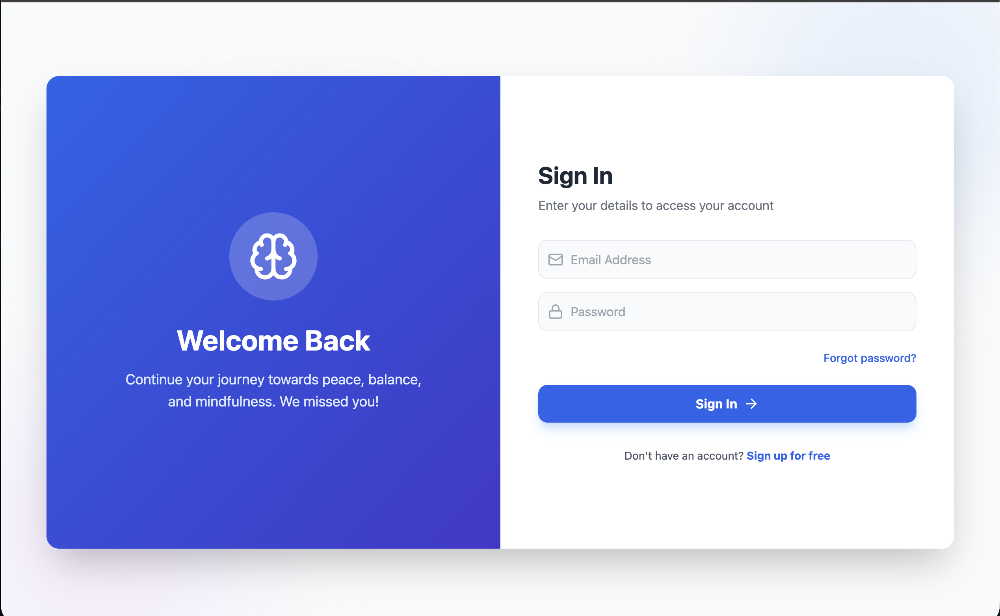
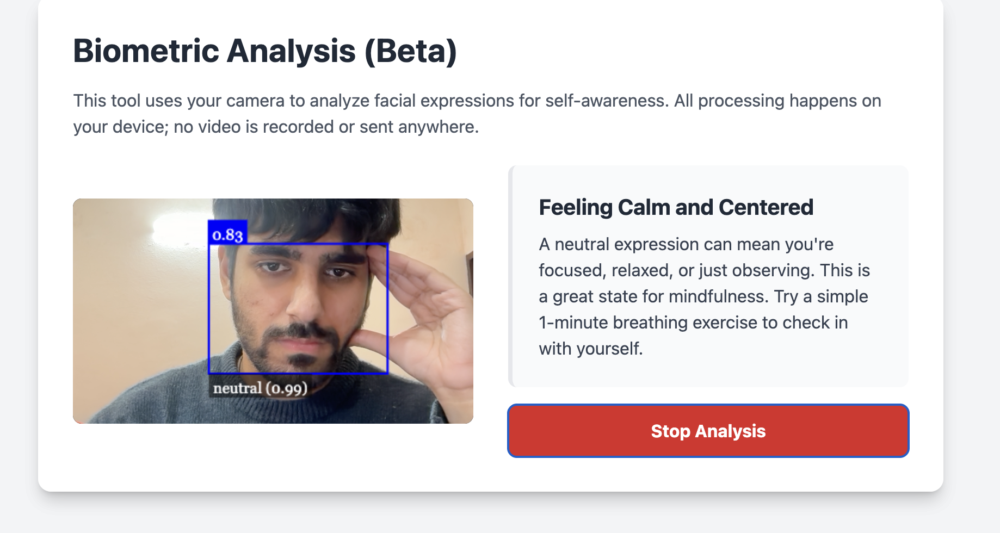
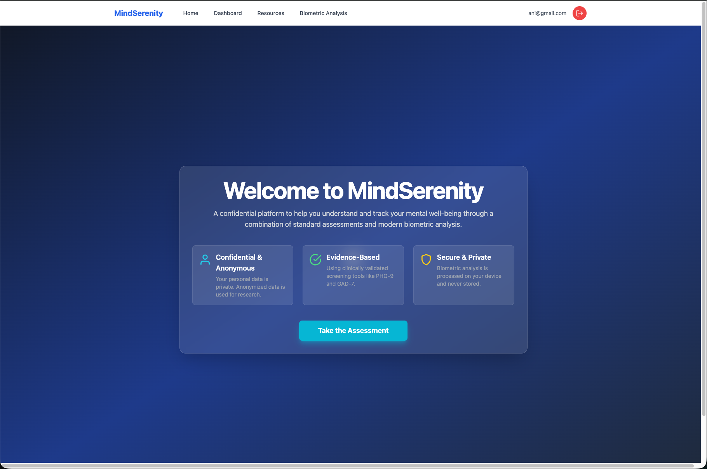

# 🌿 MindSerenity: AI-Powered Mental Wellness Platform
*Transforming Minds, Empowering Wellness Every Day*

[🎥 **Watch MindSerenity Intro Video**](assets/MindSerenity_Intro.mp4)

> **Overview**: I designed and built MindSerenity as a comprehensive mental wellness application. It combines real-time AI emotion detection, immersive 3D visual therapy, and data-driven insights to help users understand and improve their mental state.

---

## 🚀 Key Features & Implementation

### 1. 🔐 Interactive Authentication

I built a secure and engaging authentication system using **Firebase Auth**. 
- **User Experience**: I used **Framer Motion** to create smooth transitions between Login and Signup modes, making the experience feel premium and fluid.
- **Design**: The page features a split-screen layout with animated background blobs and glassmorphism effects, styled with **Tailwind CSS**.
- **Backend**: It handles user sessions securely, creating a user profile in **Firestore** upon registration.

### 2. 🤖 AI-Powered Emotion Detection
I integrated **face-api.js** to perform real-time biometric analysis directly in the browser.
- **How it works**: The app accesses the user's webcam (with permission) and runs lightweight neural networks to detect facial expressions.
- **Privacy First**: All processing happens client-side; no video feed is sent to the server.
- **Application**: The detected mood influences the UI and prompts, helping users become more self-aware.

### 3. 📊 Biometric Analytics & Dashboard

To help users track their progress, I created a detailed dashboard.
- **Data Visualization**: I used **Chart.js** (`react-chartjs-2`) to render interactive graphs of the user's mood trends and survey results over time.
- **Survey System**: I implemented a multi-step assessment (PHQ-9, GAD-7) using React state to manage the flow and Firestore to store the anonymized results for analysis.
- **Insights**: The dashboard provides actionable insights based on the collected data, helping users identify patterns in their mental health.

### 4. 🎨 Immersive 3D Experience

I wanted the home page to be a calming sanctuary.
- **3D Elements**: I incorporated 3D visuals to create a sense of depth and tranquility.
- **Design System**: I established a consistent design system using **Lucide React** icons and a soothing color palette to ensure the entire app feels cohesive and relaxing.

---

## 🛠️ Tech Stack Explained

I chose a modern, scalable stack to build this application:

### Frontend
- **React.js**: Used for building a component-based, reactive user interface.
- **Tailwind CSS**: For rapid, utility-first styling that allowed me to create a completely custom design without fighting a framework.
- **Framer Motion**: To add complex animations and page transitions that enhance the user experience.
- **Lucide React**: For beautiful, consistent iconography.

### Backend & Services
- **Firebase Auth**: For robust and secure user authentication.
- **Cloud Firestore**: A NoSQL database where I store user profiles, survey data, and session logs in real-time.

### AI & Data
- **face-api.js**: A JavaScript API for face detection and face recognition in the browser implemented on top of TensorFlow.js.
- **Chart.js**: For rendering responsive charts and graphs to visualize user data.

---

## 🧭 How to Run

### 1. Clone the Repository
```bash
git clone https://github.com/AnirudhChhabra54/MindSerenity.git
cd MindSerenity
```

### 2. Install Dependencies
I use `npm` for package management.
```bash
npm install
```

### 3. Set Up Environment Variables
Create a `.env` file in the root directory. You'll need your own Firebase credentials:
```env
REACT_APP_FIREBASE_API_KEY=your_key
REACT_APP_FIREBASE_AUTH_DOMAIN=your_project.firebaseapp.com
REACT_APP_FIREBASE_PROJECT_ID=your_project
...
```

### 4. Run the App
```bash
npm start
```
The app will run at `http://localhost:3000`.

---

## 📬 Contact
**Anirudh Chhabra**  
📧 [Anirudhchhabra02@gmail.com](mailto:Anirudhchhabra02@gmail.com)  

Feel free to reach out for collaboration or questions about the architecture!

---
*Built with ❤️ by Anirudh Chhabra*
