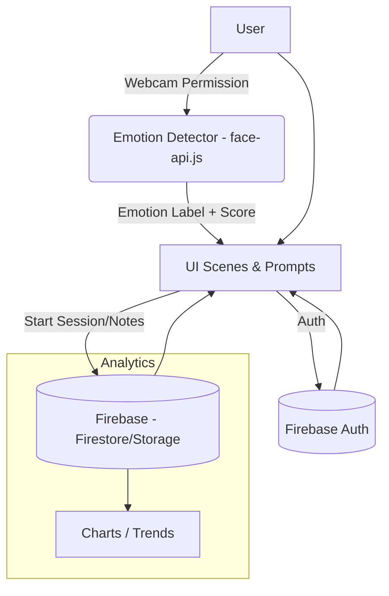

# 🌿 MindSerenity
*Transforming Minds, Empowering Wellness Every Day*


> **One‑line**: A React-based mental wellness app featuring real-time emotion detection, immersive 3D/visual scenes, progress analytics, and secure Firebase-backed auth & storage.

---

## 🔗 Quick Links
- **Live Demo**: _add link when deployed_
- **Project Board / Roadmap**: _add link if using GitHub Projects_
- **Report a Bug / Request a Feature**: open an [issue](../../issues/new/choose)

---

## ✨ Overview
MindSerenity helps users build self-awareness and calm through:
- 🤖 **Real-time emotion detection** (webcam; face-api.js)
- 🎨 **Immersive visual scenes** (e.g., *HomePage3D*, *MindfulnessGarden*)
- 🔐 **Secure auth & data** (Firebase)
- 📈 **Progress & insights** (charts & logs)
- ⚙️ **Modular, scalable architecture** (easy to extend components)

> Built for maintainability: clear folder structure, typed props, reusable UI components, and a documented workflow.

---

## 🧱 Features (at a glance)
- **Auth**: Email/Password (Firebase Auth) with protected routes
- **Emotion Analyzer**: Face expression inference (happy/sad/neutral etc.) with threshold tuning
- **Scenes**: Calm visuals, breathing prompts, gratitude journaling
- **Analytics**: Session history, streaks, simple trends via Chart.js
- **Theming**: Tailwind + PostCSS; responsive design
- **Config**: Environment-driven (no secrets in code)
- **Accessibility**: Keyboard navigation, ARIA labels on interactive elements

> Coming soon: multi-language, personalized recommendations, mobile app (React Native).

---

## 🧰 Tech Stack
- **Frontend**: React (Vite or CRA), JavaScript (ES6+)
- **Styles**: Tailwind CSS, PostCSS, Autoprefixer
- **Charts**: Chart.js
- **AI**: face-api.js (client-side models)
- **Backend/BAAS**: Firebase (Auth, Firestore/Storage as applicable)
- **Package Manager**: npm
- **Testing**: Jest + React Testing Library
- **CI/CD**: GitHub Actions (example provided)

---

## 🗂️ Project Structure
```text
MindSerenity/
├─ public/                    # static assets, model files (if served locally)
├─ src/
│  ├─ components/
│  │  ├─ EmotionDetector/     # webcam, model init, inference
│  │  ├─ Scenes/              # HomePage3D, MindfulnessGarden, etc.
│  │  ├─ Charts/              # reusable chart wrappers
│  │  └─ UI/                  # buttons, inputs, layout pieces
│  ├─ pages/                  # routed pages
│  ├─ hooks/                  # custom hooks (useAuth, useDevice, etc.)
│  ├─ context/                # React contexts (AuthContext, ThemeContext)
│  ├─ services/
│  │  ├─ firebase.js          # firebase init
│  │  └─ storage.js           # Firestore/Storage helpers (if used)
│  ├─ styles/                 # tailwind.css, globals.css
│  ├─ utils/                  # helpers, constants
│  ├─ App.jsx                 # routes
│  └─ main.jsx                # React root
├─ .env.example               # sample env (see below)
├─ package.json
└─ README.md
```

---

## 🧭 System Flow (Mermaid)


---

## ✅ Prerequisites
- **Node.js** >= 18 and **npm** >= 9
- Webcam permission (for emotion detection)
- Firebase project (if using cloud auth/storage)

---

## 🔐 Environment Setup
Create a `.env` file in the project root (never commit real secrets):
```bash
# .env (for Vite style; CRA uses REACT_APP_ prefix)
VITE_FIREBASE_API_KEY=your_key
VITE_FIREBASE_AUTH_DOMAIN=your_project.firebaseapp.com
VITE_FIREBASE_PROJECT_ID=your_project_id
VITE_FIREBASE_STORAGE_BUCKET=your_project.appspot.com
VITE_FIREBASE_MESSAGING_SENDER_ID=sender_id
VITE_FIREBASE_APP_ID=app_id
VITE_FIREBASE_MEASUREMENT_ID=G-xxxx   # optional

# Model config (optional)
VITE_EMOTION_MODEL_URL=/models       # or CDN path
```

> If using Create React App use `REACT_APP_*` prefixes instead of `VITE_*`.

Add a sample to the repo as `.env.example` (safe placeholders).

---

## 🏁 Getting Started

### 1) Clone
```bash
git clone https://github.com/AnirudhChhabra54/MindSerenity.git
cd MindSerenity
```

### 2) Install
```bash
npm install
```

### 3) Add environment file
```bash
cp .env.example .env
# fill keys
```

### 4) Run (dev)
```bash
npm start      # CRA
# or
npm run dev    # Vite
```

App defaults to `http://localhost:3000` (CRA) or the Vite port shown in the console.

---

## 🧪 Testing
```bash
npm test           # watch mode
npm run test:ci    # suggested for CI (configure in package.json)
```

> Recommended: write tests for EmotionDetector logic (mock webcam), auth guards, and UI states.

---

## 🧹 Code Quality
```bash
npm run lint       # if ESLint configured
npm run format     # if Prettier configured
```

Suggested dependencies:
```bash
npm i -D eslint prettier eslint-config-prettier eslint-plugin-react
```

`.eslintrc` and `.prettierrc` samples can be added as needed.

---

## 🧪 Emotion Detection Notes
- Loads face-api.js models on first use (can be cached)
- Ensure HTTPS and user gesture before starting webcam
- Provide a visible **toggle** to disable camera
- Allow **threshold**/smoothing for emotion classification
- Fallback UI when camera not available/denied

---

## 🔐 Firebase Notes
- Keep API keys in `.env` (even though Firebase keys are public-ish, treat them as config)
- Set **Security Rules** (sample for Firestore):
```js
rules_version = '2';
service cloud.firestore {
  match /databases/{database}/documents {
    match /users/{uid}/sessions/{doc} {
      allow read, write: if request.auth != null && request.auth.uid == uid;
    }
  }
}
```
- Avoid storing raw images/videos unless necessary; prefer aggregated metrics.

---

## 📸 Screenshots
Create a `docs/images/` folder and add screenshots. Example markdown:
```md


```

---

## 🚀 Deployment

### Netlify / Vercel (recommended)
- Add environment variables in dashboard
- Build command: `npm run build`
- Output directory: `build` (CRA) or `dist` (Vite)

### GitHub Pages (CRA)
```bash
npm i -D gh-pages
# package.json
# "homepage": "https://<user>.github.io/MindSerenity",
# "scripts": { "predeploy": "npm run build", "deploy": "gh-pages -d build" }
npm run deploy
```

---

## 🤖 CI/CD (GitHub Actions example)
Save as `.github/workflows/ci.yml`:
```yaml
name: CI
on: [push, pull_request]
jobs:
  build:
    runs-on: ubuntu-latest
    steps:
      - uses: actions/checkout@v4
      - uses: actions/setup-node@v4
        with:
          node-version: 20
      - run: npm ci
      - run: npm test --if-present
      - run: npm run build --if-present
```

---

## 🧭 Usage Tips
- Use **feature branches** and PRs
- Commit messages: **Conventional Commits** (e.g., `feat: add breathing scene`)
- Keep components **small** and **testable**
- Prefer **hooks** for logic reuse

---

## 📊 Dev vs Prod (Quick Diff)
| Topic | Dev | Prod |
|---|---|---|
| Build | `npm start` / `npm run dev` | `npm run build` |
| Source maps | On | Usually off |
| Performance | Lower | Optimized |
| Env file | `.env` (dev keys) | `.env` (prod keys in platform) |

---

## 🩺 Privacy & Ethics
- Obtain **explicit consent** before using the webcam
- Show **camera status** and **clear disclaimers**
- Store only **minimal** necessary data; prefer **aggregates**
- Provide an **opt-out** and **data deletion** request path

---

## 🤝 Contributing
1. Fork the repo
2. Create a branch: `git checkout -b feat/your-feature`
3. Commit: `git commit -m "feat: add X"`
4. Push: `git push origin feat/your-feature`
5. Open a Pull Request

> See `CONTRIBUTING.md` for guidelines (suggested).

---

## 🧾 License
**MIT** – see `LICENSE`.

---

## 🙏 Acknowledgements
- face-api.js contributors
- Firebase
- Chart.js
- Tailwind CSS

---

## 🗺️ Roadmap (short)
- [ ] Multi-language (i18n)
- [ ] Personalized recommendations
- [ ] Offline-first modes
- [ ] Mobile app (React Native)
- [ ] Advanced analytics dashboard

---

## 🧩 .gitignore (recommended)
```
# dependencies
node_modules/

# production / build outputs
build/
dist/

# env & logs
.env
.env.*
npm-debug.log*
yarn-error.log*

# misc
.DS_Store
```

---

## ❓FAQ / Troubleshooting
- **Webcam not working?** Check HTTPS & browser permissions. Try another browser.
- **Models load slowly?** Host models on a CDN or preload at app start.
- **Firebase auth fails?** Verify domain whitelisting in Firebase Console.
- **White screen after deploy?** Check correct `homepage` (CRA) or router base path and environment vars.
